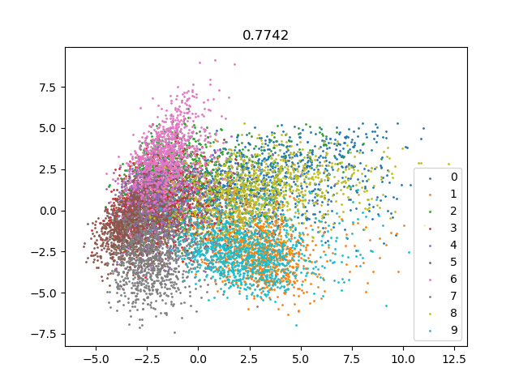
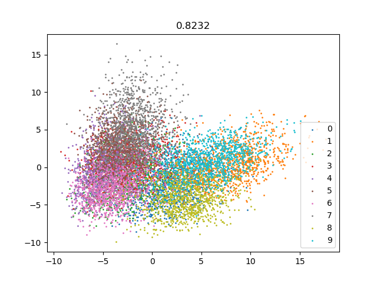
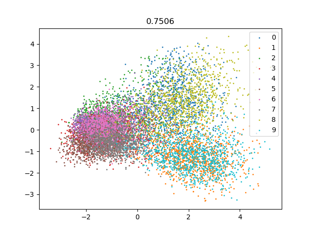
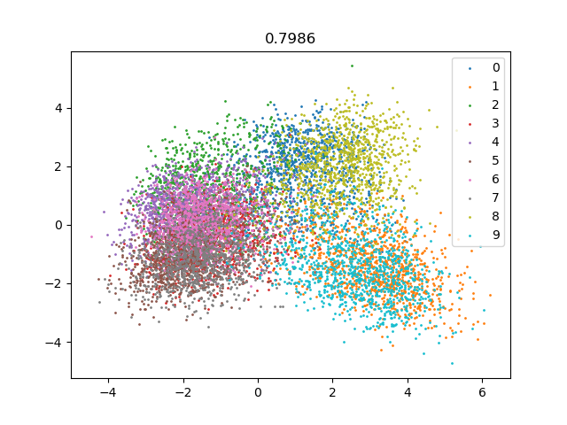
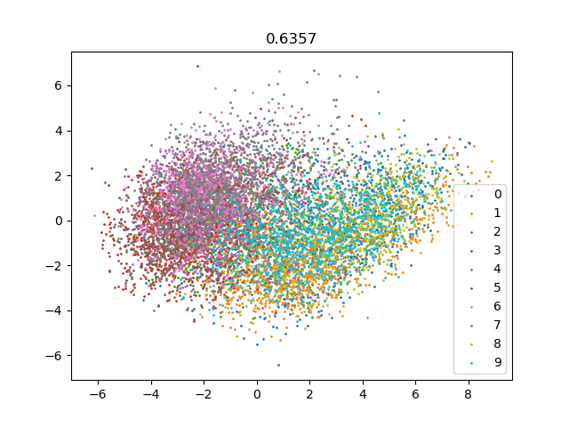
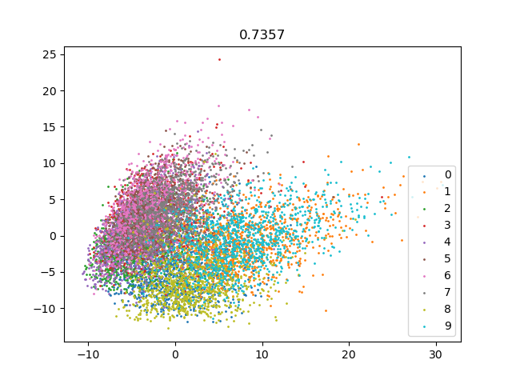
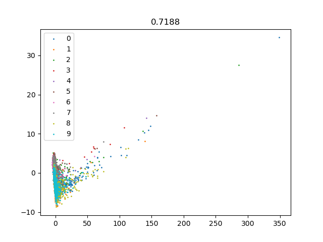
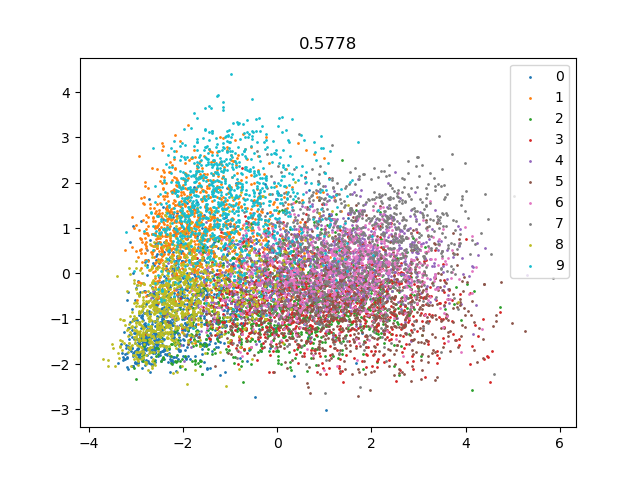

latent expansion
===

### Architecture
1. network structure
    - Adversarial network
    - Simple convolutional network with variational latent space
2. loss function
    - with triplet loss
    - without triplet loss
3. latent space dimention
    - large -> 1024
    - small -> 32

### Result
 - dataset : CIFAR10 

|latent space|adae|vae|
|-|-|-|
|1024|||
|32|||
|1024 triplet|||
|32 triplet|||

- Performance is better if the latent space has a higher dimension than the previous layer.  
- Triplet loss affects performance degradation.  
- The variational layers improve model performance.

### Enviroment
tensorflow = 2.10